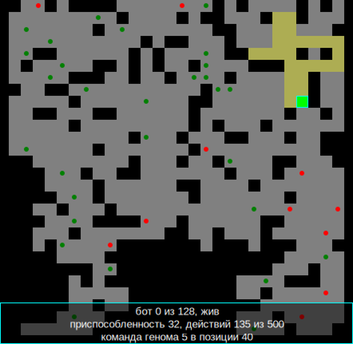

# DP_Gen_Bots

Симулятор эволюции: популяция из 128 ботов с геномом из 64 команд учится
собирать яблоки и не наступать на яд на клеточном поле со стенами.
Написано на PascalABC.NET, графика — GraphABC.



## Как это устроено

**Поле** — сетка 30×30. По периметру стена, внутри случайные стены, яблоки
и яд. Свободная область всегда связна: запертых карманов не бывает.

**Бот** живёт на своей копии поля — боты не взаимодействуют, каждый проходит
собственный прогон в одинаковой стартовой раскладке. У бота есть координаты,
направление, позиция в геноме и лимит в 500 действий.

**Геном** — 64 гена со значениями `0..63`. Ген играет две роли сразу:
номер команды — это остаток от деления на 6, а само значение служит
смещением относительного перехода. Поэтому мутация одного гена осмысленна
в обеих ролях, а куски генома остаются работоспособными после кроссовера.

### Команды

| Код | Команда | Действие |
|----|---------|----------|
| 0 | идти вперёд | пусто — шаг, яблоко — съесть, **яд — гибель**, стена — стоять на месте |
| 1 | повернуть вправо | |
| 2 | повернуть влево | |
| 3 | уничтожить яд | если яд прямо по курсу — убрать его и получить очки |
| 4 | сенсор | ситуация выбирает элемент таблицы переходов в следующих шести генах |
| 5 | переход | безусловный относительный переход на смещение из следующего гена |

Сенсор различает шесть ситуаций: яблоко впереди, яд впереди, стена впереди,
яблоко слева, яблоко справа, свободно.

### Приспособленность

| Событие | Очки |
|---------|------|
| съедено яблоко | +6 |
| уничтожен яд | +3 |
| впервые посещена клетка | +1 |

За поворот очки не начисляются: иначе выгоднее всего крутиться на месте.
Наступить на яд — смерть, это единственный отрицательный стимул.

### Эволюция

Двенадцать лучших геномов переходят в новое поколение без изменений.
Остальные получаются двухточечным кроссовером двух родителей, выбранных
рулеткой пропорционально приспособленности, с последующей мутацией.

Раз в 25 поколений пересматриваются два параметра по среднему за окно:

* **вероятность мутации** растёт при затяжном отсутствии роста и снижается,
  когда рост есть или когда популяция начала деградировать;
* **сложность среды** (больше стен, меньше яблок) растёт только когда
  популяция вышла на плато выше порога, то есть освоила текущий уровень.

## Сборка и запуск

Нужен [PascalABC.NET](https://pascalabc.net/). Открыть `DP_Gen_Bots.pas`
и нажать F9, либо из консоли:

```
pabcnetcclear DP_Gen_Bots.pas
DP_Gen_Bots.exe
```

Проект собирается и консольным компилятором под Mono:

```
mono pabcnetcclear.exe DP_Gen_Bots.pas
```

## Управление

| Клавиша | Действие |
|---------|----------|
| пробел | пауза |
| G | график по поколениям |
| F | поле выбранного бота |
| ← → | выбрать другого бота |
| B | выбрать самого приспособленного |
| щелчок мышью | переключить график и поле |

На поле: серое — свободно, чёрное — стена, зелёные точки — яблоки,
красные — яд, жёлтый след — клетки, посещённые выбранным ботом.

## Журнал прогона

Каждое поколение дописывается строкой в `gen_bots_log.csv`:

```
generation;avg_fitness;max_fitness;mutation_rate;apples;walls;duration_ms
```

Зерно генератора случайных чисел задаётся константой `RANDOM_SEED` в
`DP_Config.pas` и по умолчанию фиксировано, поэтому два запуска дают
одинаковый журнал. Поставьте `0`, чтобы каждый запуск отличался.

## Структура

| Модуль | Отвечает за |
|--------|-------------|
| `DP_Config` | все параметры модели |
| `DP_World` | поле, генерация карты, содержимое клеток |
| `DP_Bot` | бот и виртуальная машина генома |
| `DP_Evolution` | отбор, кроссовер, мутация, история, журнал |
| `DP_Render` | отрисовка поля и графика |
| `DP_Interface` | текстовые примитивы поверх картинки |
| `DP_Control` | клавиатура и мышь |
| `DP_Gen_Bots` | главный цикл |

`DP_Config`, `DP_World`, `DP_Bot` и `DP_Evolution` не зависят от GraphABC —
модель можно прогонять без окна, в пакетном режиме.

## Лицензия

[GNU GPL v3](LICENSE).
